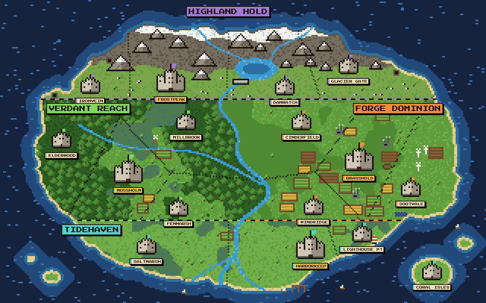
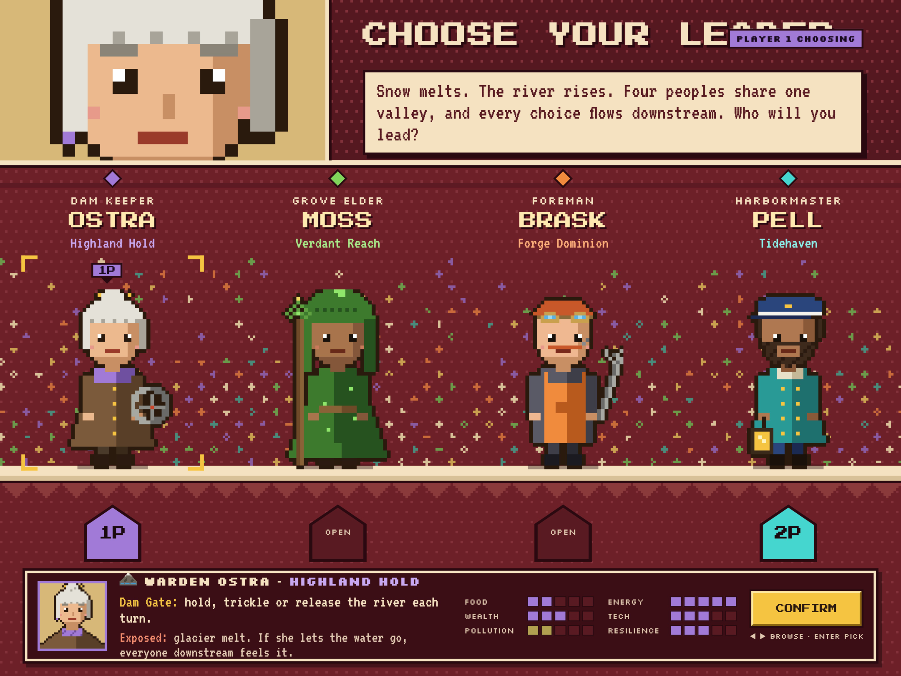
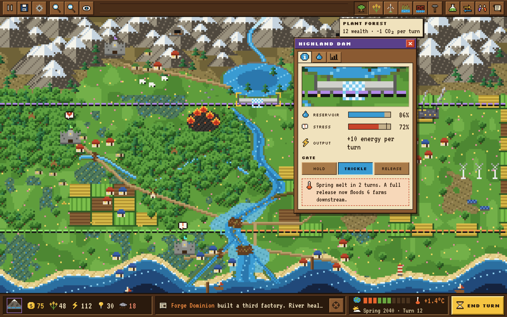
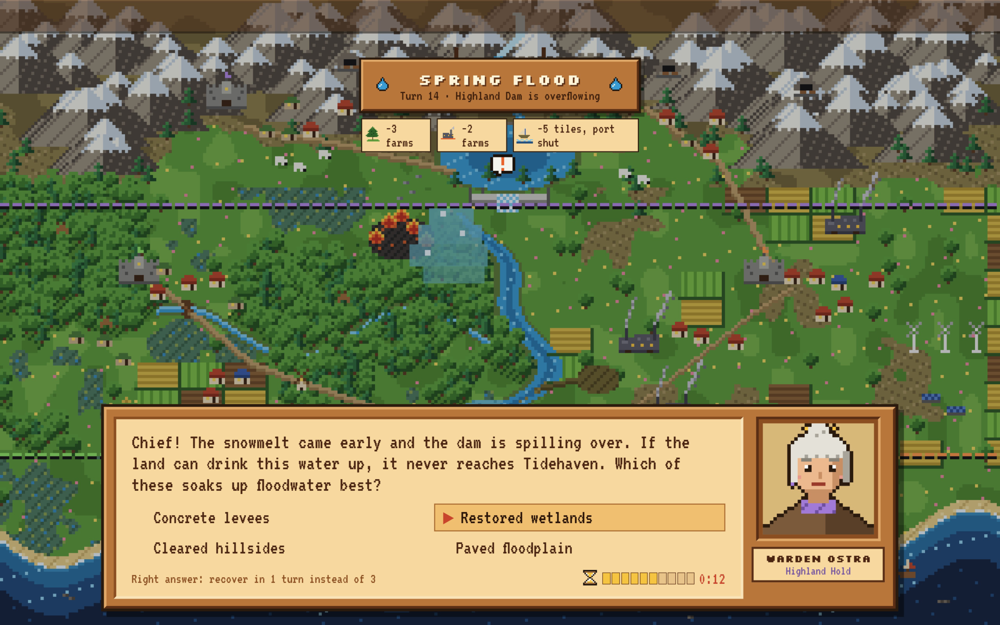
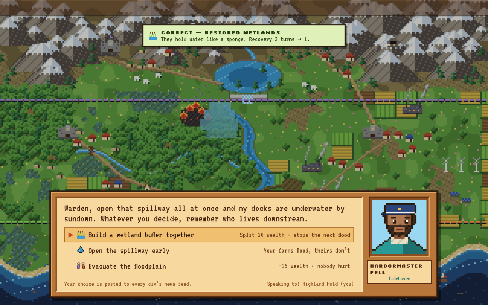

# EARTHSHARE

> One river. Four civilizations. Every choice flows downstream.

A 4-player, turn-based, 8-bit strategy game about sustainability, built for MHacks 26. Four civilizations share one valley and one river. A dam release upstream, a clear-cut or factory runoff lands on your neighbors, so you learn by managing the trade-offs.

- **Build guide:** [`AGENTS.md`](AGENTS.md) (rules, art direction, data model, MVP)
- **Earlier design notes:** [`SPEC.md`](SPEC.md)

## Design reference

### World map
Each region is split into smaller areas, and each area is marked by a castle. Capitals have gold nameplates.

### Choose your leader

### Game screen (HUD)

### Climate event 1: advisor quiz

### Climate event 2: neighbor response

> The HUD and event mockups still show the old map. Their UI is the reference; the terrain is replaced by the world map above.
